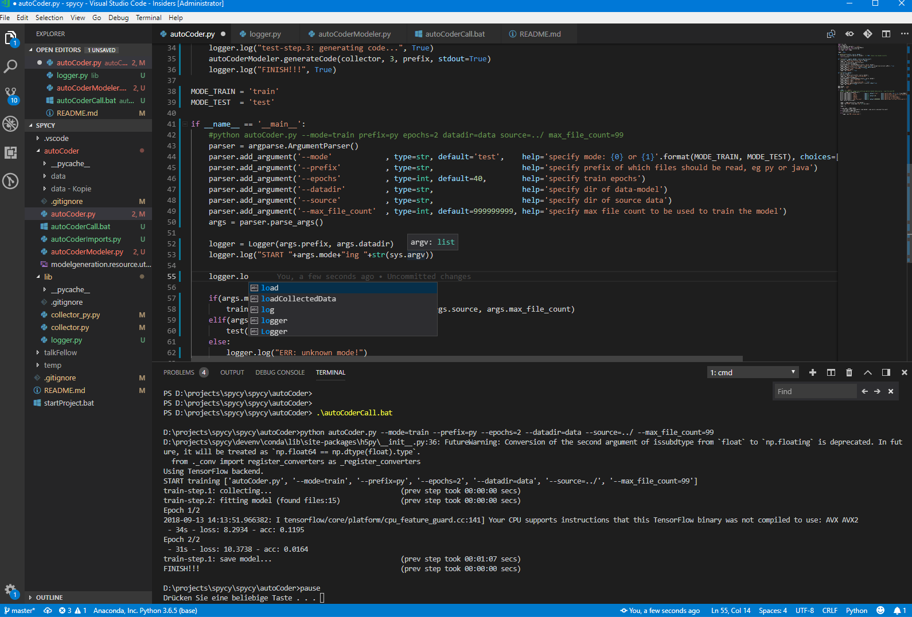
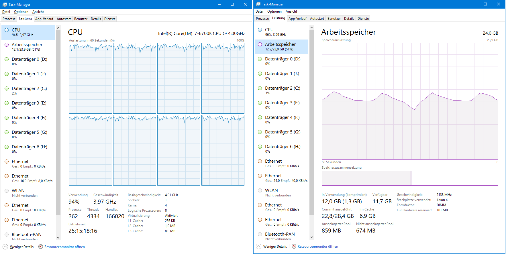

# Spycy
## spicy python machine learning & AI recipes

### VSCode plugins
	Python 3

## autoCoder
### program learns to program; generates program code automatically.
	Scripts read in source code files of a certain type, generates a Keras model of it, so that it can generate new code itself.

	Model generation of ~40.000 files takes 6 days (without GPU). The generated keras model file is x MB big.

### jupyter
	

## TalkFellow
### Setup - from stratch
	cd talkFellow
	# create py virtual environment
	python -m venv ../../venvs/talkFellow
	# on linux: source ../../venvs/talkFellow/bin/activate
	# ..\..\venvs\talkFellow\Scripts\activate.bat -> Parameterformat falsch - 850
	..\..\venvs\talkFellow\Scripts\Activate.ps1

	python -m pip install --upgrade pip
	pip install --upgrade setuptools

	chcp 65001	//=vscode terminal set encoding to utf-8			# better: "terminal.integrated.shellArgs.windows": ["/K", "chcp 65001"], 
	pip install -r requirements.txt

	# inc ase of errors, get newest version & adjust requirements.txt , eg:
	pip install matplotlib
	pip install numpy
	pip install pandas
	pip install --ignore-installed --upgrade tensorflow
	pip install --ignore-installed --upgrade tensorflow-gpu

#### Execution
	..\..\venvs\talkFellow\Scripts\Activate.ps1

### Setup - with conda:
	cd talkFellow

	optional - use a virtual environment
		#creates new python env in d:\projects\spycy\devenv\conda\envs\talkFellow\
		conda create -n talkFellow
		#list envs
		conda info -e
		activate talkFellow
		conda info -e

	conda install tensorflow
	execute tensorflowchecker.py & check if tensorflow installation ok

	# install seq2seq
	conda install -c anaconda msgpack-python				//installs it into d:\projects\spycy\devenv\conda\pkgs\ (if not in venv!)
	git clone https://github.com/google/seq2seq.git
	cd seq2seq
	pip install -e .

	fix 2 imports of d:\projects\spycy\libs\seq2seq\seq2seq\contrib\seq2seq\helper.py :
		from tensorflow.python.ops.distributions import bernoulli
		from tensorflow.python.ops.distributions import categorical

	conda install nltk

#### Execution

## Q&A
	Message
		I tensorflow/core/platform/cpu_feature_guard.cc:141] Your CPU supports instructions that this TensorFlow binary was not compiled to use: AVX AVX2
	Solution:
		Build tensorflow explicitely for your machine or install one with the CPU support from
		https://github.com/fo40225/tensorflow-windows-wheel
		https://github.com/lakshayg/tensorflow-build

		pip install --ignore-installed --upgrade d:\projects\spycy\libs\tensorflow-1.4.0-cp36-cp36m-win_amd64.whl
		(from https://github.com/fo40225/tensorflow-windows-wheel/blob/master/1.4.0/py36/CPU/avx2/tensorflow-1.4.0-cp36-cp36m-win_amd64.whl)

