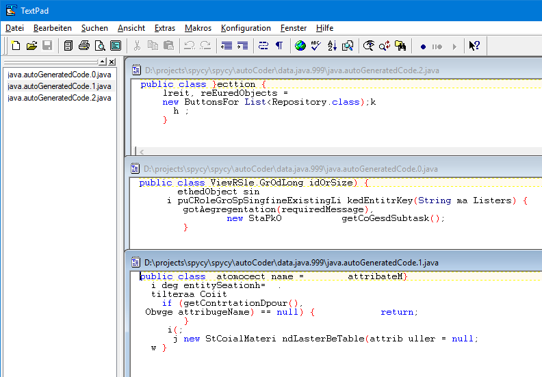
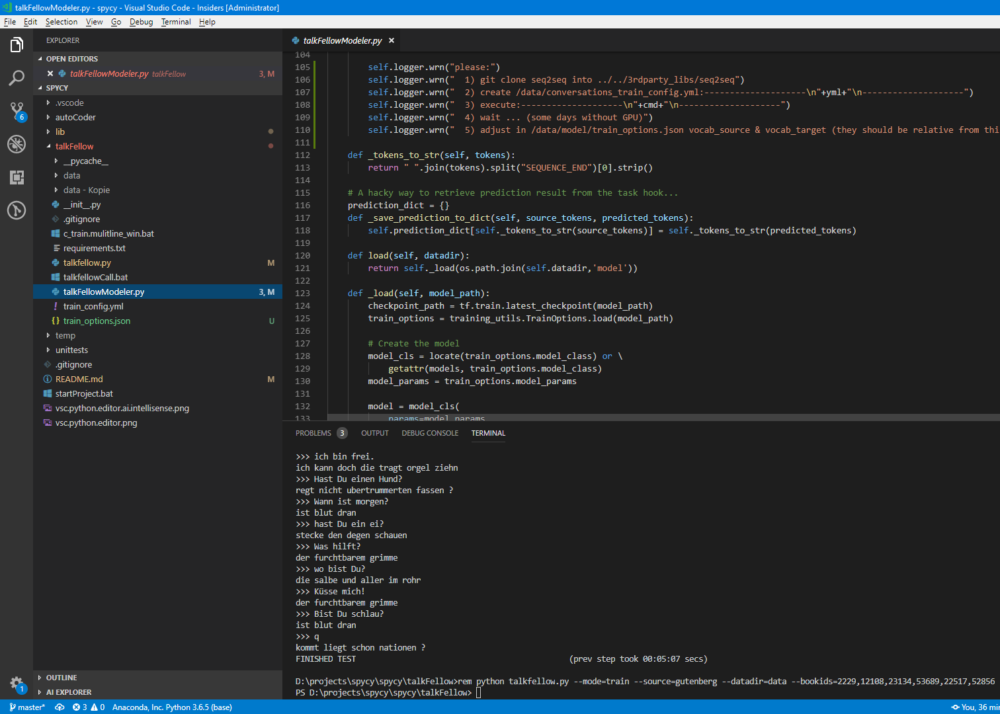
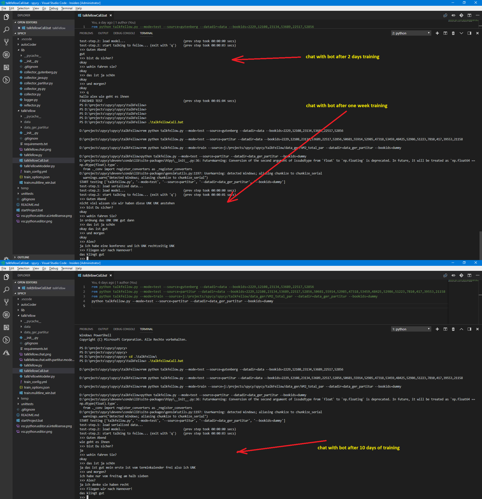
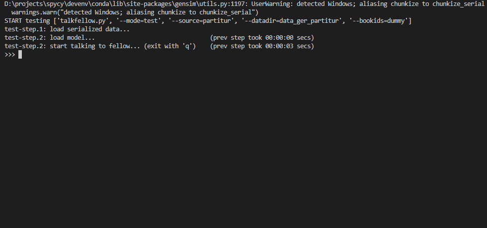
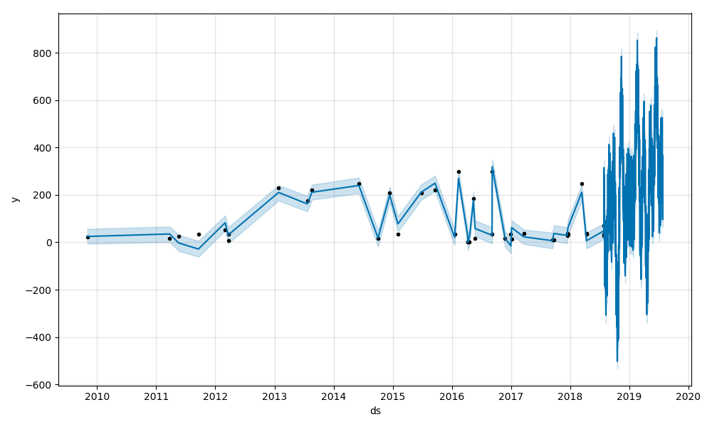
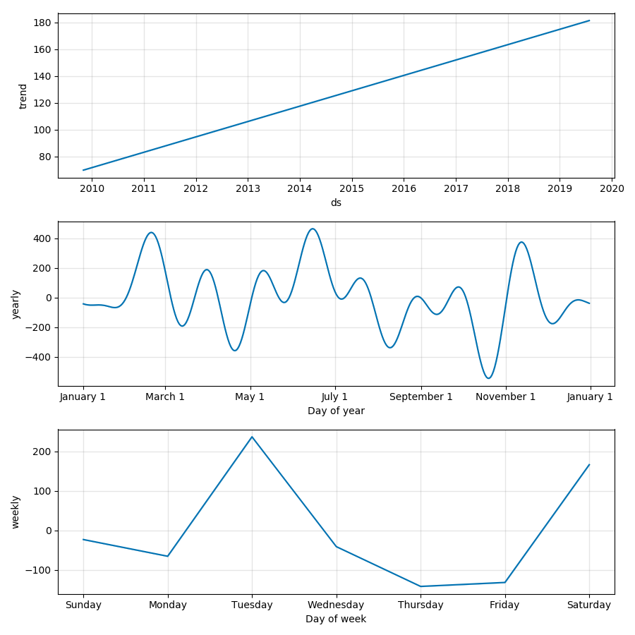
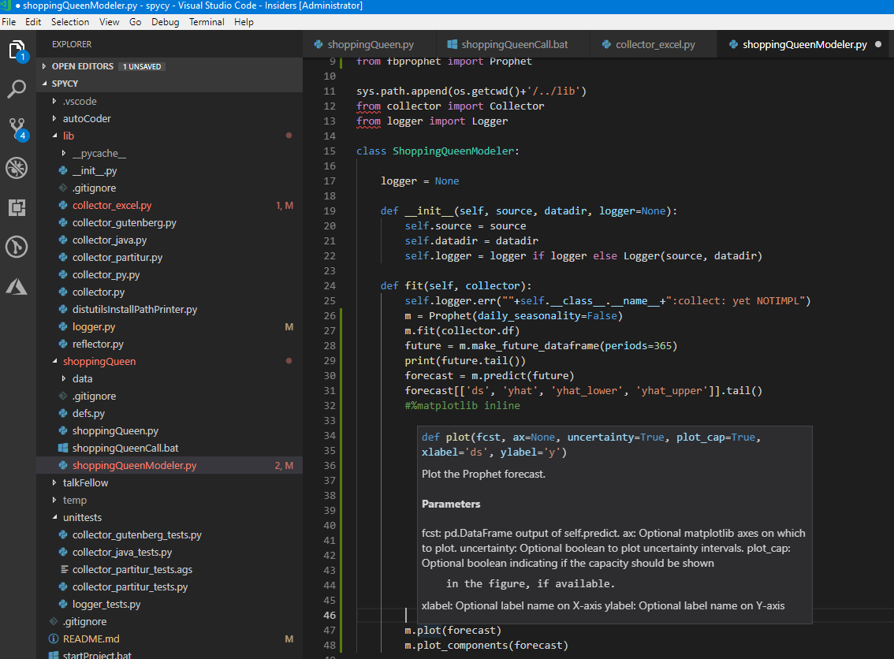

# Spycy
## Spicy python machine learning & AI recipes:
### 1: AutoCoder (Code-Generator):			[chapter 1](#1-autocoder)
### 2: TalkFellow (Chat Bot): 				[chapter 2](#2-talkfellow)
### 3: ShoppingQueen (Shopping Predictor): 	[chapter 3](#3-shoppingqueen)

.

### VSCode plugins
	Python 3, AI, jupyter, GitLens

## 1: autoCoder
### program learns to program; generates program code automatically.
	Scripts read in source code files of a certain type, generates a Keras model of it, so that it can generate new code itself.

	Model generation based on 1000 code files(in sum 5 MB) and 22 epochs takes about 12 hour (without GPU!). The generated keras model file is ~40 MB big.
	
##### VS Code with Python IntelliSense:

##### Resource Utilization during training:

##### Auto-Generated Java Code examples (based on a very small pretrained model after a day training):

##### TODO:
	Train larger model
	Save train options with pretty format (indent)
	Compile Tensorflow with AVX & AVX2 support.

#### Jupyter:
Use Jupyter Notebooks for data exploration

## 2: TalkFellow
### Setup - from stratch
	cd talkFellow
	# create py virtual environment
	python -m venv ../../venvs/talkFellow
	# on linux: source ../../venvs/talkFellow/bin/activate
	# ..\..\venvs\talkFellow\Scripts\activate.bat -> Parameterformat falsch - 850
	..\..\venvs\talkFellow\Scripts\Activate.ps1

	python -m pip install --upgrade pip
	pip install --upgrade setuptools

	chcp 65001	//=vscode terminal set encoding to utf-8			# better: "terminal.integrated.shellArgs.windows": ["/K", "chcp 65001"], 
	pip install -r requirements.txt

	# inc ase of errors, get newest version & adjust requirements.txt , eg:
	pip install matplotlib
	pip install numpy
	pip install pandas
	pip install --ignore-installed --upgrade tensorflow
	pip install --ignore-installed --upgrade tensorflow-gpu

#### Execution
	Activate python environment called 'talkFellow':
	..\..\venvs\talkFellow\Scripts\Activate.ps1

### Setup - with Anaconda (conda, for Windows):
	cd talkFellow

	optional - use a virtual environment
		#creates new python env in \spycy\devenv\conda\envs\talkFellow\
		conda create -n talkFellow
		#list envs
		conda info -e
		activate talkFellow
		conda info -e

	conda install tensorflow
	execute tensorflowchecker.py & check if tensorflow installation ok

	# install seq2seq
	conda install -c anaconda msgpack-python				//installs it into \spycy\devenv\conda\pkgs\ (if not in venv!)
	git clone https://github.com/google/seq2seq.git
	cd seq2seq
	pip install -e .

	fix 2 imports of \spycy\libs\seq2seq\seq2seq\contrib\seq2seq\helper.py :
		from tensorflow.python.ops.distributions import bernoulli
		from tensorflow.python.ops.distributions import categorical

	conda install nltk

#### Execution (here an example chat with the bot in German, data source: www.gutenberg.org/)

#### Execution (here an example chat with the bot in German, data source: Verbmobil ( http://www.bas.uni-muenchen.de/forschung/Verbmobil/Verbmobil.html ))

##### TODO:
	Train with real cool german conversations, from ftp://ftp.bas.uni-muenchen.de/pub/BAS/VM/
	automatize train_config.yml generation & seq2seq call
	Look for larger german conversation data sources on nltk.download_shell()

## 3: ShoppingQueen
	Predicts future expenses based on past data.
	Third party library: Prophet of Facebook ( https://github.com/facebook/prophet/ )
	Input: Amazon shopping history 2009 - 2018
	Result graphs of prediction:

##### TODO:
	Use a Youtube playlist as datasource for prediction!
	Customize plotted prediction graph for 3D display.

## Q&A
	Message:
		I tensorflow/core/platform/cpu_feature_guard.cc:141] Your CPU supports instructions that this TensorFlow binary was not compiled to use: AVX AVX2
	Solution:
		Build tensorflow explicitely for your machine or install one with the CPU support from
		https://github.com/fo40225/tensorflow-windows-wheel
		https://github.com/lakshayg/tensorflow-build

		pip install --ignore-installed --upgrade \spycy\libs\tensorflow-1.4.0-cp36-cp36m-win_amd64.whl
		(from https://github.com/fo40225/tensorflow-windows-wheel/blob/master/1.4.0/py36/CPU/avx2/tensorflow-1.4.0-cp36-cp36m-win_amd64.whl)
		(...and possibly you have to reinstall keras in the required version)

	Question:
		How to install seq2seq?
	Answer:
		git clone https://github.com/google/seq2seq.git
		cd seq2seq
		# Install package and dependencies
		pip install -e .

	Question:
		I get the exception "ResourceExhaustedError OOM when allocating tensor with shape" when training my seq2seq model
		What to do?
	Answer:
		1) reduce '--batch_size 1024'		
		2) reduce your sentence length when generating with the collector

	Question:
		How long does the train step take to create a model with seq2seq without a GPU?
	Answer:
		Weeks (!) or more!
		(see discussion on https://stackoverflow.com/questions/42464288/what-is-the-expected-time-of-training-for-the-following-seq2seq-model#42466486 )
		Solution: it is strongly recommended to use GPU-based training, e.g. on a cloud server
		(all the largest clould provider (AWS, Azure and Google GCP) offer GPU support)

	Question:
		Where can I find large open text data sources for training the machine learning algorithm?
	Answer:
		Search in the large open human language database of https://www.nltk.org/:
		The nltk shell allows downloading open source data, e.g. from http://gutenberg.org/
			import nltk
			nltk.download('gutenberg')
			# or with the nltk download shell:
			nltk.download_shell()

		Look on http://www.bas.uni-muenchen.de/forschung/Verbmobil/ for large German conversation data sources.

	Question:
		How to install the Facebook-Prophet python library on windows in an Anaconda environment?
	Answer:
		Installation steps:
			- $ conda install libpython m2w64-toolchain -c msys2
			- config distutils (import distutils & print(distutils.__file__))
				PYTHONPATH\Lib\distutils\distutils.cfg
				[build]
				compiler=mingw32
			- $ conda install gcc
			- $ conda install numpy cython -c conda-forge						#overwrites customized tensorflow installation!
			- $ conda install matplotlib scipy pandas -c conda-forge
			- $ conda install pystan -c conda-forge
			- $ conda install -c conda-forge fbprophet

	Question:
		When trying to plot a graph, I get the error message
			'This application failed to start because it could not find or load the Qt platform plugin "windows"'
			...with installed Anaconda, incl. the Qt plugin ($ conda install qt)
	Answer:
		COPY the
			%DEVENV%\conda\Library\plugins\platforms
			folder to
			%DEVENV%\conda
		//the other alternative: extend your %HATH% with %DEVENV%\conda\Library\plugins\platforms

##### VS Code with Python IntelliSense:

